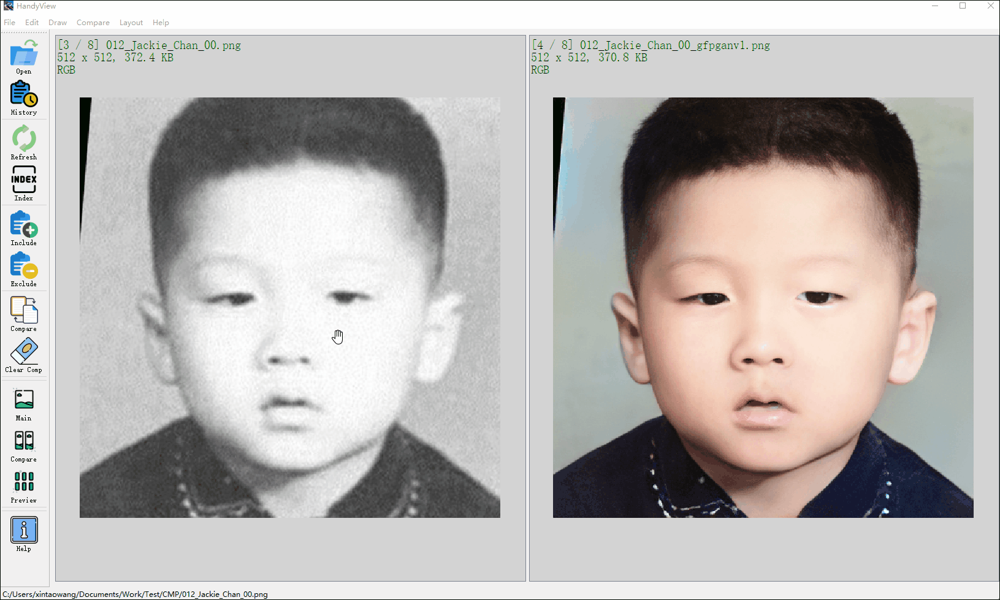
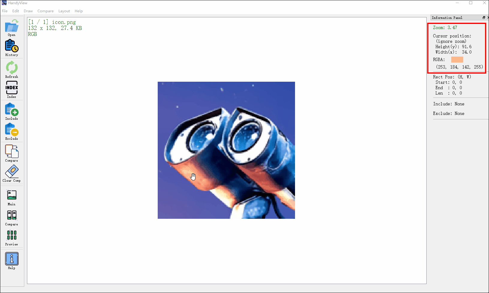

#  HandyView

[English](README.md) **|** [简体中文](README_CN.md) &emsp; [GitHub](https://github.com/xinntao/HandyView) **|** [Gitee码云](https://gitee.com/xinntao/HandyView)

```Handy``` *Series*:

 [HandyView](https://github.com/xinntao/HandyView) &emsp;  [HandyFigure](https://github.com/xinntao/HandyFigure) &emsp;  [HandyCrawler](https://github.com/xinntao/HandyCrawler)
&emsp;  [HandyWriting](https://github.com/xinntao/HandyWriting)

---

HandyView is a **handy image viewer** for convenient viewing and comparing. It is developed with PyQt5.

## :sparkles: Features

- Switch among images **with fixed zoom ration**, which is useful when comparing image details. (Unfortunately, I cannot find such a image viewer and this is the initial motivation to develop HandyView).
- Various comparison modes.
- Show basic image information, *e.g.*, image path, shape, size, color type, zoom ration, etc.
- Show the position and color in the current mouse cursor.
- Draw rectangles on images and show the start and end position.

## :eyes: Screenshot

- Current screenshot: Main View

<p align="center">
  
</p>

- Current screenshot: Preview

<p align="center">
  
</p>

- Switch among images with **fixed zoom ratio**

<p align="center">
  
</p>

- Comparison View: compare images in two-column or three-column modes (in the same folder or accross multiple folders with the same file count)

<p align="center">
  
</p>

- Show the position and color of the current mouse cursor

<p align="center">
  
</p>

- Draw rectangles and show the start and end positions

<p align="center">
  
</p>

- Accurate zoom rendering in QT/PyQt using QGraphicsView. Many QT applications show distorted text and lines upon zooming/resizing, which is an inherent limitation how QGraphicsView handles QGraphicsScene images. The solution is to have QGraphicsScene handle resizing. HandyView's 'Fast Zoom' feature is QGraphicsView handling zoom. With 'Fast Zoom' disabled HandyView performs accurate zoom rendering handled by QGraphicsScene. 'Fast Zoom' can be disabled in option dialog. Fast-zoomed images can be accurately rendered by clicking inside the scroll ara and hitting CTRL+R.

<p align="center">
  
</p>

<p align="center">
  
</p>

## :wrench: Usage

I have now tested it on Windows. It should also work on Ubuntu (but may with some modifications).

### 

#### Option 1: Pre-compiled executable zip file

I have zipped an exe zip file with pyinstaller in the release page ([Github](https://github.com/xinntao/HandyView/releases) | [Gitee](https://gitee.com/xinntao/HandyView/releases)). You can first have a try on it.

1. Unzip the file
2. Set HandyView as the default image viewer, so that you can **double-click the image to open** HandyView.

#### Option 2: Python environment

- Anaconda (Python >= 3.5)

1. Clone repo

    ```bash
    git clone https://github.com/xinntao/HandyView.git
    ```

1. Install dependent packages

    ```bash
    cd HandyView
    pip install -r requirements.txt
    ```

In the command line, run:

> python handyview/handyviewer.py [image_path]

#### Option 3: Python environment + Compile to executable program

Use `pyinstaller` to compile to executable program, so that you can **double-click the image to open** the HandyView.

1. > pyinstaller -D handyview/handyview.py -i icon.ico --windowed
1. You will see a `dist` folder containing the outputs (dll, exe, etc)
1. Copy necessary files to the `dist` folder
    > cp -r icons dist/handyviewer/ <br>
    > cp icon.png dist/handyviewer/ <br>
    > cp icon.ico dist/handyviewer/ <br>
1. Choose the `dist/handyview/handyviewer.exe` as the default image viewer.

### 

I used the early version of HandyView on Ubuntu. The current version is not tested on Ubuntu and may be out-of-date.

1. Clone this repo `git clone git@github.com:xinntao/HandyView.git`
1. How to double click to open an image
    1. Modify the HandyView.desktop file - *Exec & Icon*
    1. Copy the .desktop file to `/usr/share/applications`
1. How to change the default image viewer
    1. Right click an image
    1. Go to `Properties` -> `Open With`
    1. Choose *HandyView*

## :book: Document (On the way)

The basic operation (such as shortcut keys) could be found in the *Help* button in the toolbar.

## :hourglass_flowing_sand: TODO list

- [ ] preview mode
- [ ] show zoom info for each folder (store in database)
- [ ] drag together in the multi-view comparison mode

### Editing operation

- [ ] Simple image edit: crop, resize, color conversion, etc
- [ ] Draw rectangular and enlarged the area
- [ ] Make GIF easily

## :books: References

- [Qt5 doc](https://doc.qt.io/qt-5/)
- [PyQt5 doc](https://doc.qt.io/qtforpython/api.html)
- [Qt Key](https://doc.qt.io/archives/qtjambi-4.5.2_01/com/trolltech/qt/core/Qt.Key.html)

## :scroll: License and Acknowledgement

This project is released under the [MIT license](./LICENSE).

### Icons

I have used the icons from [flaticon](www.flaticon.com) and [pixabay](https://pixabay.com/). The following are the source links.

| Icon | Link | Icon | Link | Icon |Link|
| :--- | :---:        |     :---      | :---: | :---        |     :---:      |
|   | [Open](https://www.flaticon.com/free-icon/open_3143203?term=file%20open&page=1&position=1) | |[History](https://www.flaticon.com/free-icon/timer_2921268) |  |[Refresh](https://www.flaticon.com/free-icon/reuse_3299869?term=refresh&page=1&position=16) |
|   | [Index](https://www.flaticon.com/free-icon/index_2807595?term=index&page=1&position=8) |  |[Include](https://www.flaticon.com/free-icon/add_2921226) | |[Exclude](https://www.flaticon.com/free-icon/remove_2921203) |
|   | [Compare](https://www.flaticon.com/free-icon/file_748614?term=compare&page=1&position=17) |  |[Clear comparison](https://www.flaticon.com/free-icon/eraser_3277337?term=clear&page=1&position=5) |  |[Help](https://www.flaticon.com/free-icon/information-point_4231321?term=help&page=1&position=87&page=1&position=87)|
|   | [Main canvas](https://www.flaticon.com/free-icon/image_3603103) |  |[Compare canvas](https://www.flaticon.com/free-icon/portraits_3603402) |    |[Preview canvas](https://www.flaticon.com/free-icon/pieces_3603403)|
|   | [Fingerprint](https://www.flaticon.com/free-icon/fingerprint_2313448?term=fingerprint&page=1&position=7) |  |  |  | |


## :e-mail: Contact

If you have any question, please open an issue or email `xintao.wang@outlook.com`.
