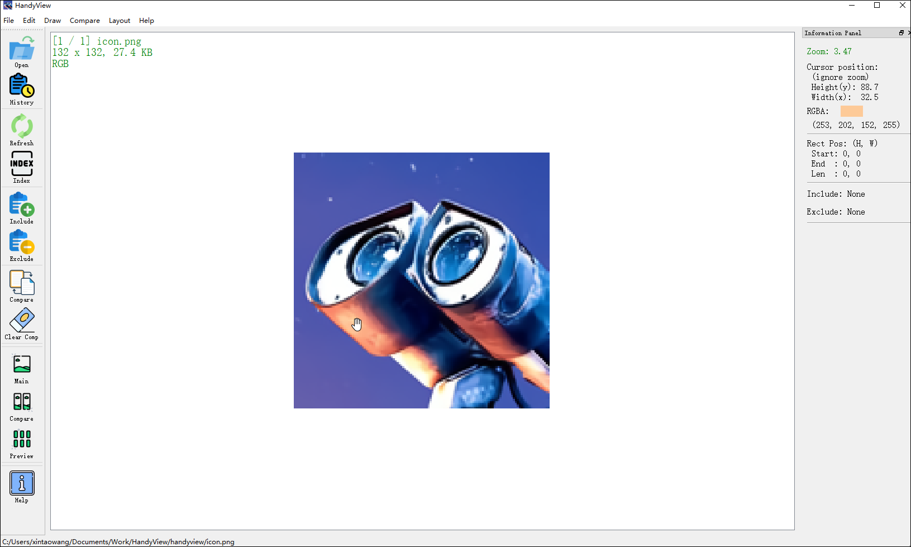
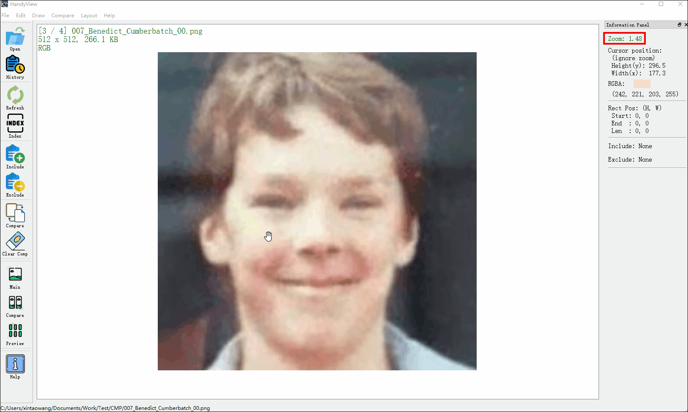
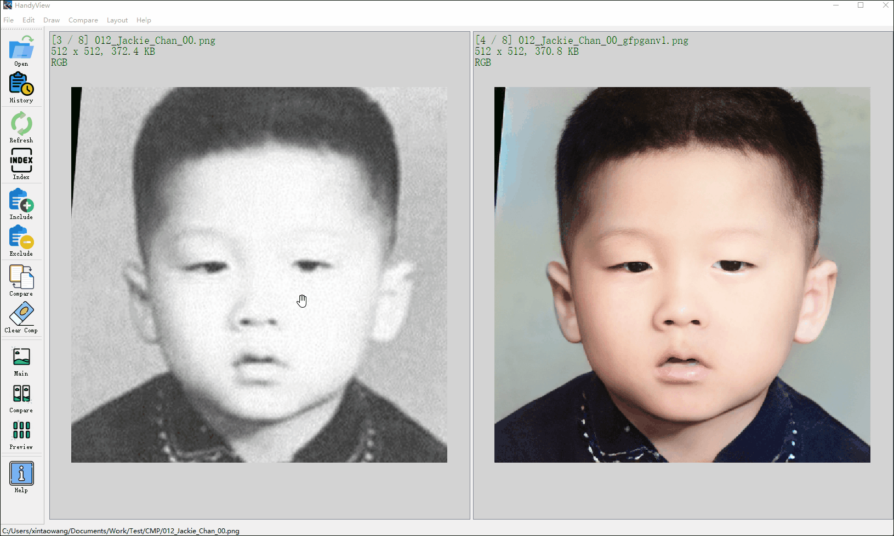
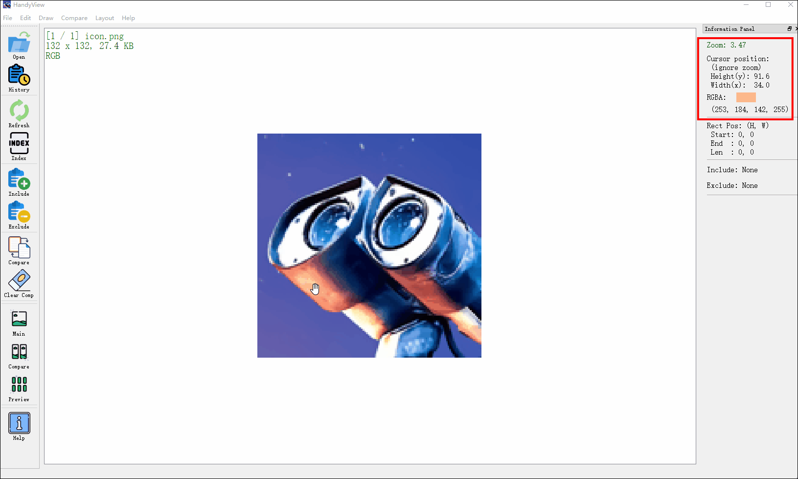
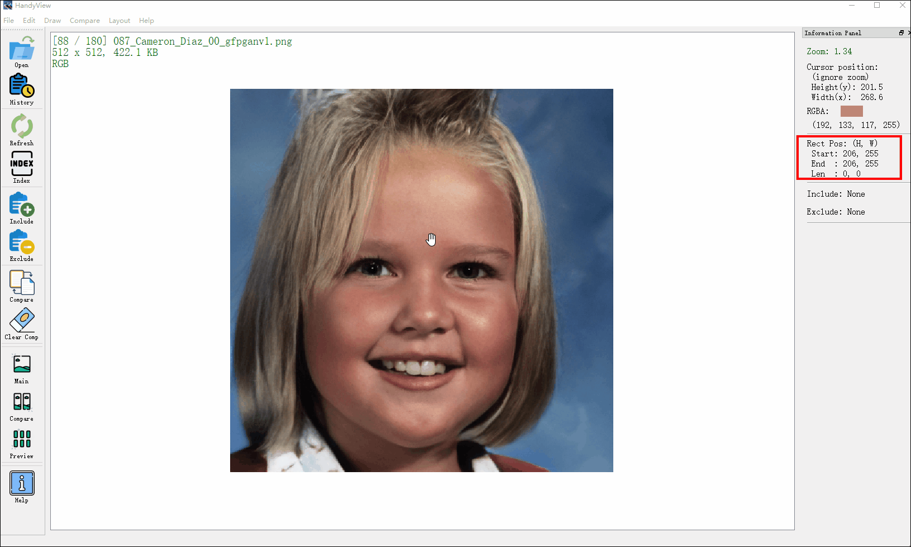

<p align="center">
  
</p>

## <div align="center"><b><a href="README.md">English</a> | <a href="README_CN.md">简体中文</a></b></div>

<div align="center">

[](https://github.com/xinntao/HandyView/releases)

[](https://pypi.org/project/handyview/)
[](https://github.com/xinntao/HandyView/blob/master/LICENSE)
[](https://github.com/xinntao/HandyView/blob/master/.github/workflows/pylint.yml)
[](https://github.com/xinntao/HandyView/blob/master/.github/workflows/publish-pip.yml)
[](https://github.com/xinntao/HandyView/blob/master/.github/workflows/release.yml)

</div>

<div align="center">

  🔻[**下载安装文件**](https://github.com/xinntao/HandyView/releases) **|** 🔧[**安装**](#-安装) **|** 📕[**使用说明**](docs)
</div>

HandyView 是一款基于 PyQt5 开发的方便的图像查看和比对工具

---

```Handy``` *Series*: &emsp;&emsp;
 [HandyView](https://gitee.com/xinntao/HandyView) &emsp;  [HandyFigure](https://gitee.com/xinntao/HandyFigure) &emsp;  [HandyCrawler](https://gitee.com/xinntao/HandyCrawler)
&emsp;  [HandyWriting](https://gitee.com/xinntao/HandyWriting)


## 🔧 安装

### 

1. Download the pre-compiled executable zip file from the release page ([Github](https://github.com/xinntao/HandyView/releases).
2. Unzip the file
3. Set HandyView as the default image viewer, so that you can **double-click the image to open** HandyView.

### 

1. Download the handyviewer.dmg from the release page ([Github](https://github.com/xinntao/HandyView/releases) and install.
2. If you fail to install the app, you may first need to [disable gatekeeper](https://disable-gatekeeper.github.io/) first. You should be aware of the risk of [disabling gatekeeper](https://disable-gatekeeper.github.io/).
3. Set HandyView as the default image viewer (use `cmd+i`), so that you can **double-click the image to open** HandyView.

### 

I used the early version of HandyView on Ubuntu. The current version is not tested on Ubuntu and may be out-of-date.

1. Clone this repo `git clone https://github.com/xinntao/HandyView.git`
1. How to double click to open an image
    1. Modify the HandyView.desktop file - *Exec & Icon*
    1. Copy the .desktop file to `/usr/share/applications`
1. How to change the default image viewer
    1. Right click an image
    1. Go to `Properties` -> `Open With`
    1. Choose *HandyView*

### 

For python user, you can also launch HandyView from the command line:

1. Clone repo and install dependent packages

    ```bash
    git clone https://github.com/xinntao/HandyView.git
    cd HandyView
    pip install -r requirements.txt
    ```

2. Run

    ```bash
    python -m handyview.handyviewer [image_path]
    ```

## :sparkles: 特性

- **固定放大比率**下, 图像切换对比. 能够看出不同方法(不同参数)下复原图像的细微差异
- 显示图像基本信息: 长宽, 尺寸大小; 特别是**鼠标所在位置**的坐标和RGB颜色
- 更丰富实用的**对比模式**. 比如:
    - 我们做实验, 往往会把得到的验证集结果放在**两个文件夹**里面, 比如 Exp_results_1 和 Exp_results_2, 这两个文件夹里面的图像往往是对应的. 那么, 我们希望能够方便快捷地对比这两个文件夹里图像的质量
    - 除了上面提到的**切换图像**来*动态地*对比, 我们也希望能够**双栏/多栏***肩并肩地*对比
- 更加便捷地筛选需要对比的图像. 在实际实验中, 往往会把很多结果放在同一个文件夹里面. 这些图像仅仅是后缀名称不同. 那么我们希望根据后缀的字符来**包含或者剔除**一些对比图像
- 能够在图中画框, 方便地知道所画框的**起始位置**和长宽信息

## :eyes: 展示

- HandyView截图

<p align="center">
  
</p>

- **固定放大比率**下, 图像切换对比

<p align="center">
  
</p>

- 多视图比较, 双栏、三栏*肩并肩*比较

<p align="center">
  
</p>

- 当移动鼠标, 右侧会显示当前鼠标所在坐标及像素颜色值

<p align="center">
  
</p>

- 拖动鼠标画框时, 右边会显示框的起始位置和长宽信息

<p align="center">
  
</p>

## Compile to executable program

For Windows and MacOS users, you can find the instructions of compiling the executable program from [how-to-build](how_to_build.md).

## :book: 文档 (还在路上...)

基本的操作可以通过 工具栏的 *Help* 按钮来查看

## :hourglass_flowing_sand: TODO list

- [ ] preview mode
- [ ] show zoom info for each folder (store in database)
- [ ] drag together in the multi-view comparison mode
### Editing operation

- [ ] Simple image edit: crop, resize, color conversion, etc
- [ ] Draw rectangular and enlarged the area
- [ ] Make GIF easily

## :books: References

- [Qt5 doc](https://doc.qt.io/qt-5/)
- [PyQt5 doc](https://doc.qt.io/qtforpython/api.html)
- [Qt Key](https://doc.qt.io/archives/qtjambi-4.5.2_01/com/trolltech/qt/core/Qt.Key.html)

## :scroll: 许可和致谢

本项目使用 [MIT license](./LICENSE).

### 图标

I have used the icons from [flaticon](www.flaticon.com). The following are the source links.

| Icon | Link | Icon | Link | Icon |Link|
| :--- | :---:        |     :---      | :---: | :---        |     :---:      |
|   | [Open](https://www.flaticon.com/free-icon/open_3143203?term=file%20open&page=1&position=1) | |[History](https://www.flaticon.com/free-icon/timer_2921268) |  |[Refresh](https://www.flaticon.com/free-icon/reuse_3299869?term=refresh&page=1&position=16) |
|   | [Index](https://www.flaticon.com/free-icon/index_2807595?term=index&page=1&position=8) |  |[Include](https://www.flaticon.com/free-icon/add_2921226) | |[Exclude](https://www.flaticon.com/free-icon/remove_2921203) |
|   | [Compare](https://www.flaticon.com/free-icon/file_748614?term=compare&page=1&position=17) |  |[Clear comparison](https://www.flaticon.com/free-icon/eraser_3277337?term=clear&page=1&position=5) |  |[Help](https://www.flaticon.com/free-icon/information-point_4231321?term=help&page=1&position=87&page=1&position=87)|
|   | [Main canvas](https://www.flaticon.com/free-icon/image_3603103) |  |[Compare canvas](https://www.flaticon.com/free-icon/portraits_3603402) |    |[Preview canvas](https://www.flaticon.com/free-icon/pieces_3603403)|
|   | [Fingerprint](https://www.flaticon.com/free-icon/fingerprint_2313448?term=fingerprint&page=1&position=7) |  | [Auto Zoom](https://www.flaticon.com/premium-icon/target_4723850?term=target%20lens&page=1&position=5&page=1&position=5&related_id=4723850&origin=search)  |  | |

## :e-mail: 联系

若有任何问题, 请提 issue 或者电邮 `xintao.wang@outlook.com`.
