# 如何利用 HandyView 裁剪 patch

## 目的

我们在写论文的过程中，需要作图以比较不同方法的结果。为了突出效果，我们往往会选中一块区域，进行放大比较。 
比如在 Real-ESRGAN 论文中的这个图：

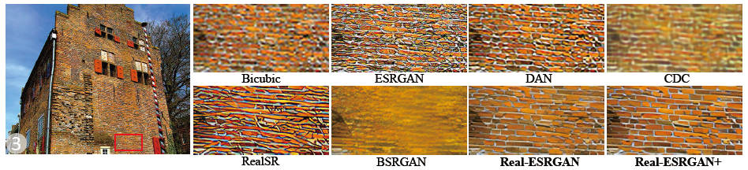

这样的图片是怎么做的呢？

1. 使用 HandyView 裁剪出所需的 patch (图像块)
2. 将裁剪好的图片放入 PPT 中，进行排版。PPT 排版很灵活，你可以按照你想要的方式进行排版，或者添加文字、注释等

下面按照步骤讲解如何使用 [HandyView](https://github.com/xinntao/HandyView) 来裁剪 patch (图像块)。

## 裁剪步骤

#### 1. 将待裁剪的图片放入到一个文件夹中

这里将三张图片放入到 `images` 的文件夹中。

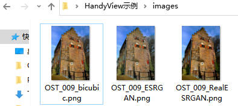

#### 2. 使用 HandyView 打开图片

打开任意一张图片都可以。

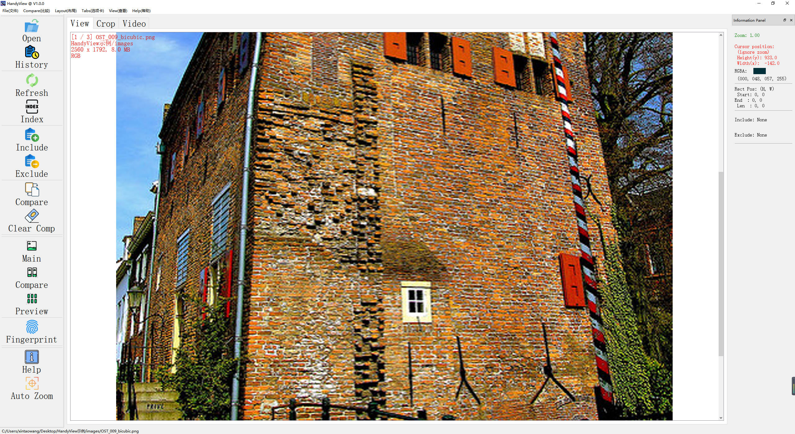

#### 3. 选择裁剪区域

按下 **Shift 键**不放松，同时**按下鼠标左键拖动鼠标**，便可以根据需要**画框**。这个框就是后面裁剪的区域。这个框一般会有一层阴影叠加显示，如下图的标红区域所示。

- 使用`Ctrl + 鼠标滚轮`或者`上下方向键↑↓`可以**缩放**图片
- 使用`鼠标滚轮`或者`左右方向键←→`可以**切换**图片。切换图片过程中，矩形框不会消失。灵活使用切换，可以挑选对比最明显的区域。
- 右边显示矩形框的**位置和大小**（你不需要记忆，HandyView 会记住的）
- 有时候你需要正方形，但是选择正方形较难。没关系！你只要选择尽可能贴近的一个矩形框即可，在后面你可以修改矩形框的参数

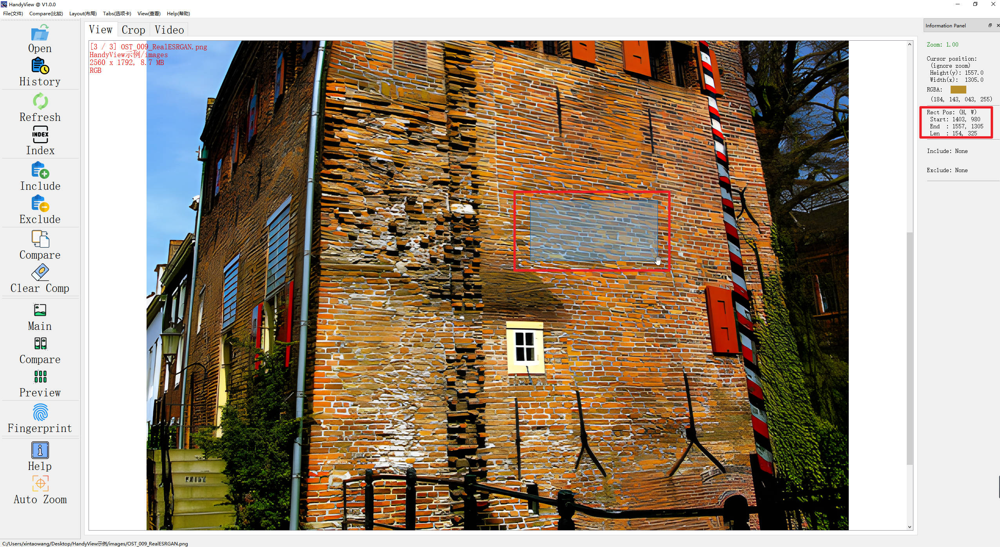

#### 4. 进入裁剪界面

点击`Crop`选项卡，进入裁剪页面。

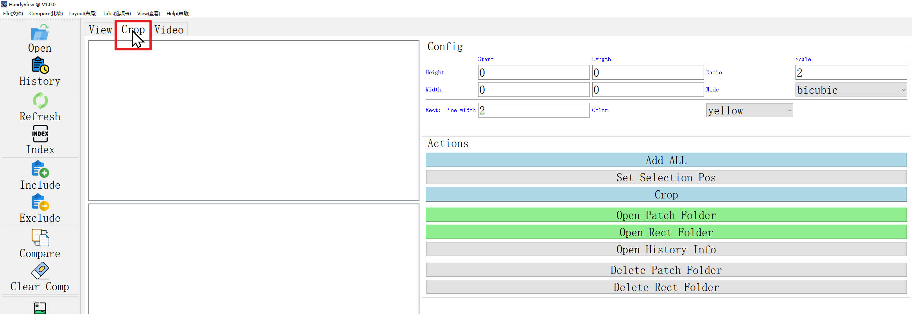

#### 5. 添加待裁剪图片

点击`Add ALL`按钮，会将文件夹中所有图片加入进来。左边会显示待裁剪图片的缩略图。

同时，HandyView 会**自动把刚才你框选的矩形框信息同步过来**。

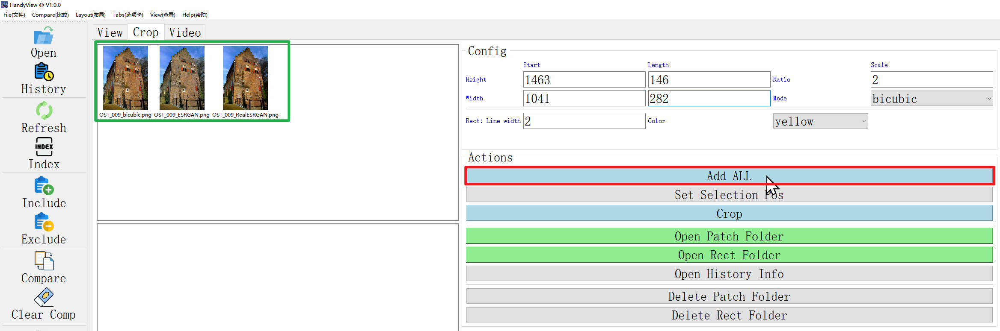

#### 6. 修改裁剪框信息

你可以根据需要修改矩形框的位置和大小。修改完后点击`Set Selection Pos`按钮，你的修改就会生效。 
如果你不需要修改，则可以跳过这个步骤，也不需要点击`Set Selection Pos`按钮。

参数含义：
- `Start`: 矩形框 `Height` 和 `Width` 起始点坐标
- `Length`: 矩形框 `Height` 和 `Width` 的长度。有时候你需要正方形，但是选择正方形较难，可以在这里进行修改，使得矩形框为正方形
- `Ratio`: crop 后的 patch 的放大倍数（我们往往会放大裁剪的 patch)
- `Mode`: 放大 cropped patch 的方式，比如有 `bicubic`, `bilinear`, `nearest`。默认 `bicubic`，因为它会最好地保留细节
- `Rect: Line width`: 画矩形框的线的宽度
- `Color`: 画矩形框的线的颜色

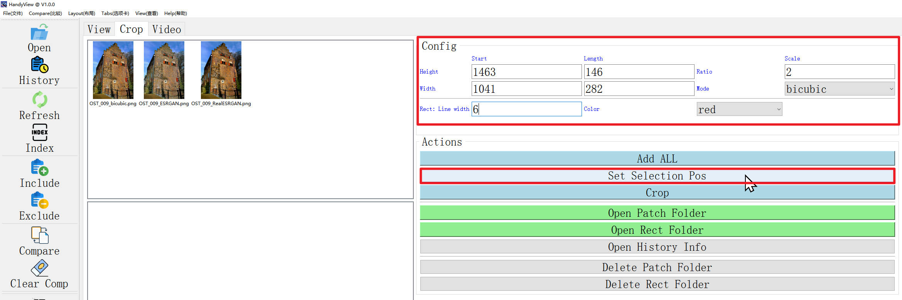

#### 7. 裁剪！

点击`Crop`按钮，会对所有图片进行裁剪。左边会显示：
- 第二行：裁剪 patch 的缩略图
- 第三行：在原图上画上裁剪矩形框的缩略图

**注意：这个步骤可能会花费一些时间，特别是当图片较大的时候。请耐心等待，不要反复点击按钮。**

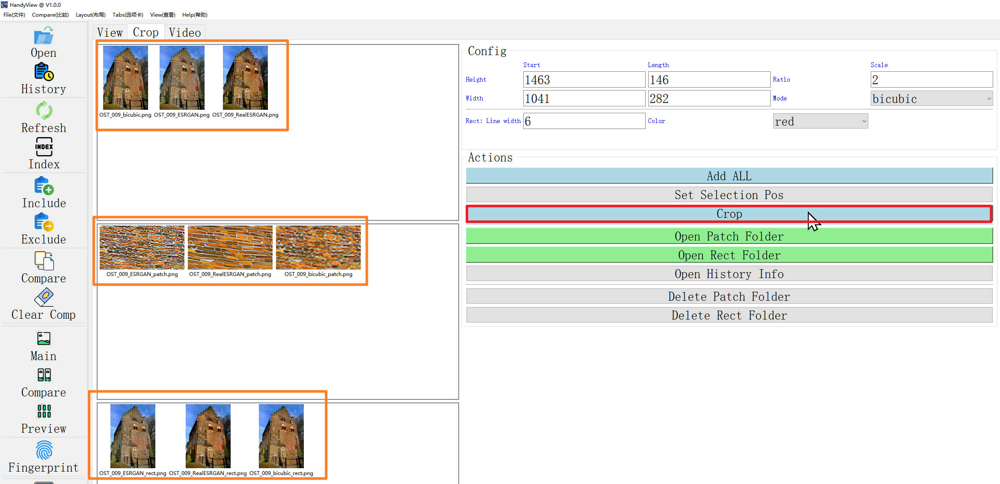

#### 8. 打开保存 patch 的文件夹

点击`Open Patch Folder`按钮，会打开保存裁剪后的 patch 的文件夹。方便你进行复制，粘贴到 PPT 中。

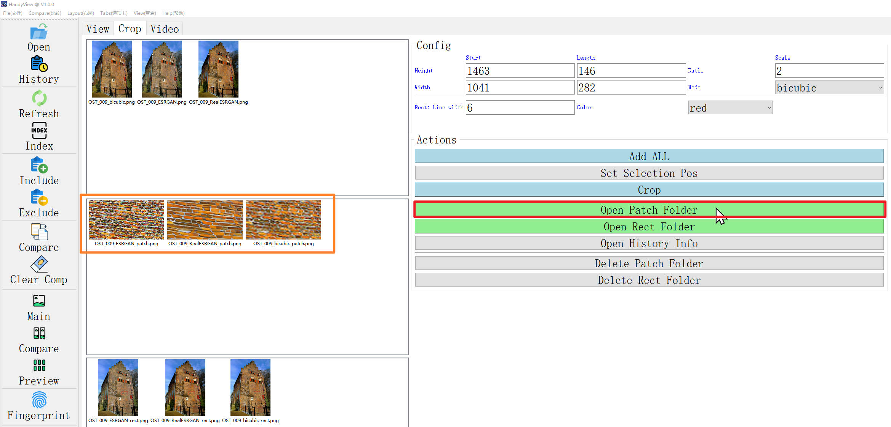

图片会保存在`crop_patch`的文件夹中。

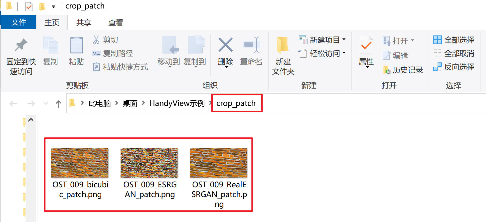

实际上，这个`crop_patch`会创建在与 待裁剪图片文件夹 同一级别的目录下。

此外，在原图上画上裁剪矩形框的图 保存在名为`draw_rect`的文件夹中。

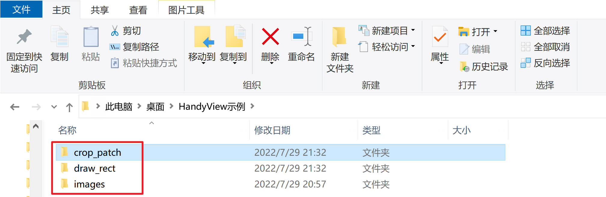

#### 9. 打开保存 画了矩形框的图 的文件夹

同上面的步骤，只要点击`Open Rect Folder`按钮，就会打开保存 画了矩形框的图 的文件夹。

#### 10. 打开历史记录

我们希望能够记住裁剪的位置，方便后续复现。只要点击`Open History Info`按钮，就会打开 txt 文件，里面记录了所有裁剪的历史。

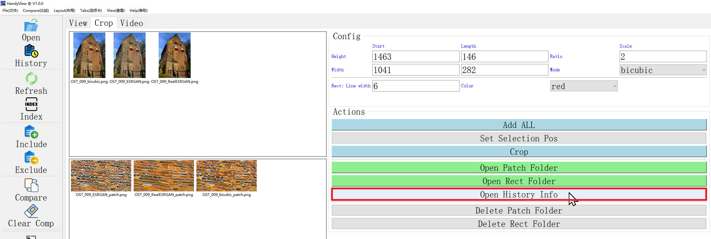

最新的记录在最下面：

